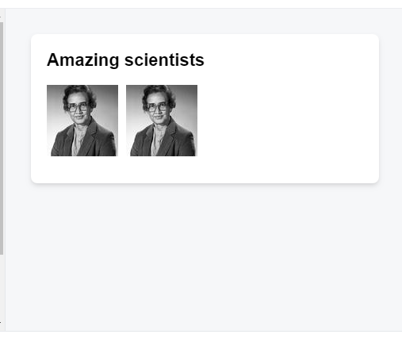

# Setting Up A React Environment

React Course

### [Introduction](https://www.theodinproject.com/lessons/node-path-react-new-setting-up-a-react-environment#introduction)

You know *what* React is and you might even have an idea of *where* to use it. Now, it’s time to start figuring out *how*.

This lesson is going to cover starting a new React project on your machine, as well as some useful tools to help you along the way. We’ll also explain some of the problems that may arise (and how to avoid them).

### [Lesson overview](https://www.theodinproject.com/lessons/node-path-react-new-setting-up-a-react-environment#lesson-overview)

This section contains a general overview of topics that you will learn in this lesson.

- How React projects can be created.
- How to use Vite to create new React projects.
- How to format the code in React projects.
- What React Developer Tools are.

### [Many paths](https://www.theodinproject.com/lessons/node-path-react-new-setting-up-a-react-environment#many-paths)

There are multiple ways to start using React in your projects, from attaching a set of `<script>` tags which serve React from a [CDN](https://en.wikipedia.org/wiki/Content_delivery_network), to robust [toolchains](https://en.wikipedia.org/wiki/Toolchain) and [frameworks](https://en.wikipedia.org/wiki/Web_framework) that are highly configurable and allow for increased scalability and optimization.

Some examples of these toolchains include:

- [Vite’s React Config](https://vitejs.dev/)
- [Gatsby](https://www.gatsbyjs.com/)
- [NextJS](https://nextjs.org/)
- [Create React App](https://create-react-app.dev/) (Deprecated)

Why do we need these toolchains? Can’t we just make our own as we see fit?

Yes, but it’s *hard*. React is a complex beast and there are many moving parts. Before you can start writing any sort of code that provides functionality, you would need to configure *at least* the following:

- Package Management ([NPM](https://www.npmjs.com/), [Yarn](https://yarnpkg.com/))
- Module bundling ([Webpack](https://webpack.js.org/), [Parcel](https://parceljs.org/))
- Compilation ([Babel](https://babeljs.io/))
- React itself

All of this, and sometimes *much more* is required to get a React project and development environment up and running.

#### [A note on Create React App](https://www.theodinproject.com/lessons/node-path-react-new-setting-up-a-react-environment#a-note-on-create-react-app)

Create React App, or CRA, was the official way to scaffold new React projects since its introduction in 2016. Unfortunately, owing to many reasons, [CRA was deprecated in early 2023](https://github.com/reactjs/react.dev/pull/5487#issuecomment-1409720741). Due to CRA’s popularity, you’ll see it mentioned in many tutorials and guides. However, it’s no longer recommended to use it for new projects.

### [Simplifying the process](https://www.theodinproject.com/lessons/node-path-react-new-setting-up-a-react-environment#simplifying-the-process)

Now that you understand what is involved with starting a React project from scratch, you can breathe a sigh of relief to learn that we can get started with a *single terminal command*.

Vite builds frontend tools for developers and it leverages the latest technologies under the hood to provide a great developer experience. Fortunately, it also caters to the React ecosystem. We will use Vite’s CLI to quickly create a template React project. It requires minimal configuration and provides extremely useful tools right out of the box, allowing us to get straight to the learning. Let’s get started!

### [Creating a React app](https://www.theodinproject.com/lessons/node-path-react-new-setting-up-a-react-environment#creating-a-react-app)

Please make sure that you are using the *LTS version of Node*, otherwise errors may occur. Fire up a terminal instance, `cd` into the folder containing your projects, and enter the following command (you can replace `my-first-react-app` with any name you want):

```bash
npm create vite@latest my-first-react-app -- --template react
```

Copy

If you see the following output, enter `y` and then press enter:

```bash
Need to install the following packages:
  create-vite@5.X.X
Ok to proceed? (y)
```

Copy

Once the command has executed, it should output the next steps for you to follow:

```bash
cd my-first-react-app
npm install
npm run dev
```

Copy

Provided everything has gone according to plan, head over to `localhost:5173`, where you’ll be greeted with the following page:

[](https://cdn.statically.io/gh/TheOdinProject/curriculum/73199c4e9e43e8d87f8759e026c13b63fcfe73c7/react/introduction/setting_up_a_react_environment/imgs/vite_react_homepage.png)

Congratulations! You’ve created your first React app.

To link your local project directory to a GitHub repo, create a new **empty** repo on GitHub then follow the instructions in the new repo’s page to connect it to your local project directory.

#### [Using an existing repo](https://www.theodinproject.com/lessons/node-path-react-new-setting-up-a-react-environment#using-an-existing-repo)

Alternatively, if you created a GitHub repo already and cloned it, you can `cd` into your cloned repo then run the above Vite command, using `.` as the project name:

```bash
npm create vite@latest . -- --template react
```

Copy

This will tell Vite to use the current directory for the project, instead of creating a new directory with the given project name. This cloned directory will already be initialized as a git repo and connected to the right remote.

### [Delving deeper](https://www.theodinproject.com/lessons/node-path-react-new-setting-up-a-react-environment#delving-deeper)

Let’s take a closer look at our new project. Inside you will find some folders, as well as `package.json`, `package-lock.json`, `.gitignore`, and `README.md` files. The `README.md` contains some useful information that you should take the time to skim through now.

The `public` folder is where all of the static assets related to your app will go. This could include images, icons, and information files for the browser.

Inside the `src` folder is where you will find the code that runs your app. The `main.jsx` file here serves as the entry point of the application. Let’s open the `main.jsx` file and see if we can understand what’s going on:

```jsx
import { StrictMode } from "react";
import { createRoot } from "react-dom/client";
import App from "./App.jsx";
import "./index.css";

createRoot(document.getElementById("root")).render(
  <StrictMode>
    <App />
  </StrictMode>,
);
```

Copy

Whoa! There’s quite a lot here. You are not expected to recognize much of this (if any) right now. Here’s a brief rundown of what is happening:

1. We import `StrictMode` and `createRoot` from the `react` and `react-dom` packages respectively.
2. We import the `App` component from `App.jsx`, so that we may place (render) it within the DOM.
3. We import some CSS styling (you may recognize this syntax from the Webpack material).
4. We create a `root` object by invoking `createRoot` with an element from our `index.html`.
5. We invoke the `render` method which is attached to our `root` object, with some very interesting-looking syntax inside the parentheses.

All of this may understandably look unlike anything you’ve seen up until now, but have no fear, once you’ve spent the time with this course, you’ll know exactly what all of this does, and *much more*.

### [Developer tools](https://www.theodinproject.com/lessons/node-path-react-new-setting-up-a-react-environment#developer-tools)

As you progress with React, your projects will undoubtedly become larger and larger and include more and more components, with increasing levels of functionality.

When this happens, it’s useful to be able to track (and make live changes to) the moving parts inside of your app for understanding and debugging your code. To this end, we can use a Chrome extension called [React Developer Tools](https://chrome.google.com/webstore/detail/react-developer-tools/fmkadmapgofadopljbjfkapdkoienihi?hl=en).

We recommend installing this and becoming comfortable using it as early as possible as it’s an invaluable tool for effective React development.

### [Assignment](https://www.theodinproject.com/lessons/node-path-react-new-setting-up-a-react-environment#assignment)

1. Review this material by reading through [Vite’s Getting Started Page](https://vitejs.dev/guide/).
2. Check out this [guide for React Developer Tools](https://www.debugbear.com/blog/react-devtools) to begin learning how to use it (don’t worry if you don’t understand some of the details yet).
3. Try to clean up your `my-first-react-app` project so that it no longer displays the default page. See if you can get it to display a “Hello, World!” message instead.

### [Knowledge check](https://www.theodinproject.com/lessons/node-path-react-new-setting-up-a-react-environment#knowledge-check)

The following questions are an opportunity to reflect on key topics in this lesson. If you can’t answer a question, click on it to review the material, but keep in mind you are not expected to memorize or master this knowledge.

- [What are some of the ways we can start a new React project?](https://www.theodinproject.com/lessons/node-path-react-new-setting-up-a-react-environment#many-paths)
- [Why should we initially be using pre-made toolchains instead of making our own?](https://www.theodinproject.com/lessons/node-path-react-new-setting-up-a-react-environment#many-paths)
- [What is Vite and why would we use it?](https://www.theodinproject.com/lessons/node-path-react-new-setting-up-a-react-environment#simplifying-the-process)
- [What command can we run to scaffold a new React project using Vite?](https://www.theodinproject.com/lessons/node-path-react-new-setting-up-a-react-environment#creating-a-react-app)
- [What is in the `public` folder?](https://www.theodinproject.com/lessons/node-path-react-new-setting-up-a-react-environment#delving-deeper)
- [What is in the `src` folder?](https://www.theodinproject.com/lessons/node-path-react-new-setting-up-a-react-environment#delving-deeper)
- [Why are the React Developer Tools useful?](https://www.theodinproject.com/lessons/node-path-react-new-setting-up-a-react-environment#developer-tools)

### [Additional resources](https://www.theodinproject.com/lessons/node-path-react-new-setting-up-a-react-environment#additional-resources)

This section contains helpful links to related content. It isn’t required, so consider it supplemental.

- [Intro to React Dev Tools](https://www.youtube.com/watch?v=rb1GWqCJid4) gets you up to speed with a quick overview of the basic features of React Dev tools in Chrome.


# Describing the UI

React is a JavaScript library for rendering user interfaces (UI). UI is built from small units like buttons, text, and images. React lets you combine them into reusable, nestable *components.* From web sites to phone apps, everything on the screen can be broken down into components. In this chapter, you’ll learn to create, customize, and conditionally display React components.

### In this chapter

- [How to write your first React component](https://react.dev/learn/your-first-component)
- [When and how to create multi-component files](https://react.dev/learn/importing-and-exporting-components)
- [How to add markup to JavaScript with JSX](https://react.dev/learn/writing-markup-with-jsx)
- [How to use curly braces with JSX to access JavaScript functionality from your components](https://react.dev/learn/javascript-in-jsx-with-curly-braces)
- [How to configure components with props](https://react.dev/learn/passing-props-to-a-component)
- [How to conditionally render components](https://react.dev/learn/conditional-rendering)
- [How to render multiple components at a time](https://react.dev/learn/rendering-lists)
- [How to avoid confusing bugs by keeping components pure](https://react.dev/learn/keeping-components-pure)
- [Why understanding your UI as trees is useful](https://react.dev/learn/understanding-your-ui-as-a-tree)

## Your first component 

React applications are built from isolated pieces of UI called *components*. A React component is a JavaScript function that you can sprinkle with markup. Components can be as small as a button, or as large as an entire page. Here is a `Gallery` component rendering three `Profile` components:

App.js


```jsx
function Profile() {

  return (

   

  );

}

export default function Gallery() {

  return (

   <section>

      <h1>Amazing scientists</h1>

     <Profile />

      <Profile />

      <Profile />

   </section>

  );

}
```




<iframe class="rounded-t-none bg-white md:shadow-md sm:rounded-lg w-full max-w-full transition-opacity absolute opacity-0 pointer-events-none duration-75" title="Sandbox Preview" sandbox="allow-forms allow-modals allow-popups allow-presentation allow-same-origin allow-scripts allow-downloads allow-pointer-lock" allow="accelerometer; camera; encrypted-media; geolocation; gyroscope; hid; microphone; midi; clipboard-write;" style="box-sizing: border-box; border: 0px solid rgb(229, 231, 235); --tw-border-spacing-x: 0; --tw-border-spacing-y: 0; --tw-translate-x: 0; --tw-translate-y: 0; --tw-rotate: 0; --tw-skew-x: 0; --tw-skew-y: 0; --tw-scale-x: 1; --tw-scale-y: 1; --tw-pan-x: ; --tw-pan-y: ; --tw-pinch-zoom: ; --tw-scroll-snap-strictness: proximity; --tw-gradient-from-position: ; --tw-gradient-via-position: ; --tw-gradient-to-position: ; --tw-ordinal: ; --tw-slashed-zero: ; --tw-numeric-figure: ; --tw-numeric-spacing: ; --tw-numeric-fraction: ; --tw-ring-inset: ; --tw-ring-offset-width: 0px; --tw-ring-offset-color: #fff; --tw-ring-color: rgba(59,130,246,.5); --tw-ring-offset-shadow: 0 0 #0000; --tw-ring-shadow: 0 0 #0000; --tw-shadow: 0 4px 6px -1px rgba(0,0,0,.1),0 2px 4px -1px rgba(0,0,0,.06); --tw-shadow-colored: 0 4px 6px -1px var(--tw-shadow-color),0 2px 4px -1px var(--tw-shadow-color); --tw-blur: ; --tw-brightness: ; --tw-contrast: ; --tw-grayscale: ; --tw-hue-rotate: ; --tw-invert: ; --tw-saturate: ; --tw-sepia: ; --tw-drop-shadow: ; --tw-backdrop-blur: ; --tw-backdrop-brightness: ; --tw-backdrop-contrast: ; --tw-backdrop-grayscale: ; --tw-backdrop-hue-rotate: ; --tw-backdrop-invert: ; --tw-backdrop-opacity: ; --tw-backdrop-saturate: ; --tw-backdrop-sepia: ; display: block; vertical-align: middle; pointer-events: none; width: 439px; max-width: 100%; border-radius: 0.5rem; --tw-bg-opacity: 1; background-color: rgb(255 255 255/var(--tw-bg-opacity)); opacity: 0; transition-property: opacity; transition-timing-function: cubic-bezier(0.4, 0, 0.2, 1); transition-duration: 75ms; box-shadow: var(--tw-ring-offset-shadow,0 0 #0000),var(--tw-ring-shadow,0 0 #0000),var(--tw-shadow); height: 15px; z-index: -1;"></iframe>


## Ready to learn this topic?

Read **[Your First Component](https://react.dev/learn/your-first-component)** to learn how to declare and use React components.

[Read More](https://react.dev/learn/your-first-component)

------

## Importing and exporting components 

You can declare many components in one file, but large files can get difficult to navigate. To solve this, you can *export* a component into its own file, and then *import* that component from another file:

Gallery.jsProfile.js

```jsx


import Profile from './Profile.js';

export default function Gallery() {

  return (

​    <section>

​      <h1>Amazing scientists</h1>

​      <Profile />

​      <Profile />

​      <Profile />

​    </section>

  );

}
```


<iframe class="rounded-t-none bg-white md:shadow-md sm:rounded-lg w-full max-w-full transition-opacity absolute opacity-0 pointer-events-none duration-75" title="Sandbox Preview" sandbox="allow-forms allow-modals allow-popups allow-presentation allow-same-origin allow-scripts allow-downloads allow-pointer-lock" allow="accelerometer; camera; encrypted-media; geolocation; gyroscope; hid; microphone; midi; clipboard-write;" style="box-sizing: border-box; border: 0px solid rgb(229, 231, 235); --tw-border-spacing-x: 0; --tw-border-spacing-y: 0; --tw-translate-x: 0; --tw-translate-y: 0; --tw-rotate: 0; --tw-skew-x: 0; --tw-skew-y: 0; --tw-scale-x: 1; --tw-scale-y: 1; --tw-pan-x: ; --tw-pan-y: ; --tw-pinch-zoom: ; --tw-scroll-snap-strictness: proximity; --tw-gradient-from-position: ; --tw-gradient-via-position: ; --tw-gradient-to-position: ; --tw-ordinal: ; --tw-slashed-zero: ; --tw-numeric-figure: ; --tw-numeric-spacing: ; --tw-numeric-fraction: ; --tw-ring-inset: ; --tw-ring-offset-width: 0px; --tw-ring-offset-color: #fff; --tw-ring-color: rgba(59,130,246,.5); --tw-ring-offset-shadow: 0 0 #0000; --tw-ring-shadow: 0 0 #0000; --tw-shadow: 0 4px 6px -1px rgba(0,0,0,.1),0 2px 4px -1px rgba(0,0,0,.06); --tw-shadow-colored: 0 4px 6px -1px var(--tw-shadow-color),0 2px 4px -1px var(--tw-shadow-color); --tw-blur: ; --tw-brightness: ; --tw-contrast: ; --tw-grayscale: ; --tw-hue-rotate: ; --tw-invert: ; --tw-saturate: ; --tw-sepia: ; --tw-drop-shadow: ; --tw-backdrop-blur: ; --tw-backdrop-brightness: ; --tw-backdrop-contrast: ; --tw-backdrop-grayscale: ; --tw-backdrop-hue-rotate: ; --tw-backdrop-invert: ; --tw-backdrop-opacity: ; --tw-backdrop-saturate: ; --tw-backdrop-sepia: ; display: block; vertical-align: middle; pointer-events: none; width: 439px; max-width: 100%; border-radius: 0.5rem; --tw-bg-opacity: 1; background-color: rgb(255 255 255/var(--tw-bg-opacity)); opacity: 0; transition-property: opacity; transition-timing-function: cubic-bezier(0.4, 0, 0.2, 1); transition-duration: 75ms; box-shadow: var(--tw-ring-offset-shadow,0 0 #0000),var(--tw-ring-shadow,0 0 #0000),var(--tw-shadow); height: 15px; z-index: -1;"></iframe>

## Ready to learn this topic?

Read **[Importing and Exporting Components](https://react.dev/learn/importing-and-exporting-components)** to learn how to split components into their own files.

[Read More](https://react.dev/learn/importing-and-exporting-components)

------

## Writing markup with JSX 

Each React component is a JavaScript function that may contain some markup that React renders into the browser. React components use a syntax extension called JSX to represent that markup. JSX looks a lot like HTML, but it is a bit stricter and can display dynamic information.

If we paste existing HTML markup into a React component, it won’t always work:

App.js

```jsx
export default function TodoList() {

  return (

​    // This doesn't quite work!

​    <h1>Hedy Lamarr's Todos</h1>

​    

​    <ul>

​      <li>Invent new traffic lights

​      <li>Rehearse a movie scene

​      <li>Improve spectrum technology

​    </ul>

  );

}
```


<iframe class="rounded-t-none bg-white md:shadow-md sm:rounded-lg w-full max-w-full transition-opacity absolute opacity-0 pointer-events-none duration-75" title="Sandbox Preview" sandbox="allow-forms allow-modals allow-popups allow-presentation allow-same-origin allow-scripts allow-downloads allow-pointer-lock" allow="accelerometer; camera; encrypted-media; geolocation; gyroscope; hid; microphone; midi; clipboard-write;" style="box-sizing: border-box; border: 0px solid rgb(229, 231, 235); --tw-border-spacing-x: 0; --tw-border-spacing-y: 0; --tw-translate-x: 0; --tw-translate-y: 0; --tw-rotate: 0; --tw-skew-x: 0; --tw-skew-y: 0; --tw-scale-x: 1; --tw-scale-y: 1; --tw-pan-x: ; --tw-pan-y: ; --tw-pinch-zoom: ; --tw-scroll-snap-strictness: proximity; --tw-gradient-from-position: ; --tw-gradient-via-position: ; --tw-gradient-to-position: ; --tw-ordinal: ; --tw-slashed-zero: ; --tw-numeric-figure: ; --tw-numeric-spacing: ; --tw-numeric-fraction: ; --tw-ring-inset: ; --tw-ring-offset-width: 0px; --tw-ring-offset-color: #fff; --tw-ring-color: rgba(59,130,246,.5); --tw-ring-offset-shadow: 0 0 #0000; --tw-ring-shadow: 0 0 #0000; --tw-shadow: 0 4px 6px -1px rgba(0,0,0,.1),0 2px 4px -1px rgba(0,0,0,.06); --tw-shadow-colored: 0 4px 6px -1px var(--tw-shadow-color),0 2px 4px -1px var(--tw-shadow-color); --tw-blur: ; --tw-brightness: ; --tw-contrast: ; --tw-grayscale: ; --tw-hue-rotate: ; --tw-invert: ; --tw-saturate: ; --tw-sepia: ; --tw-drop-shadow: ; --tw-backdrop-blur: ; --tw-backdrop-brightness: ; --tw-backdrop-contrast: ; --tw-backdrop-grayscale: ; --tw-backdrop-hue-rotate: ; --tw-backdrop-invert: ; --tw-backdrop-opacity: ; --tw-backdrop-saturate: ; --tw-backdrop-sepia: ; display: block; vertical-align: middle; pointer-events: none; width: 439px; max-width: 100%; border-radius: 0.5rem; --tw-bg-opacity: 1; background-color: rgb(255 255 255/var(--tw-bg-opacity)); opacity: 0; transition-property: opacity; transition-timing-function: cubic-bezier(0.4, 0, 0.2, 1); transition-duration: 75ms; box-shadow: var(--tw-ring-offset-shadow,0 0 #0000),var(--tw-ring-shadow,0 0 #0000),var(--tw-shadow); height: 15px; z-index: -1;"></iframe>

Show more

If you have existing HTML like this, you can fix it using a [converter](https://transform.tools/html-to-jsx):

App.js

```jsx
export default function TodoList() {

  return (

​    <>

​      <h1>Hedy Lamarr's Todos</h1>

​      

​      <ul>

​        <li>Invent new traffic lights</li>

​        <li>Rehearse a movie scene</li>

​        <li>Improve spectrum technology</li>

​      </ul>

​    </>

  );

}
```


<iframe class="rounded-t-none bg-white md:shadow-md sm:rounded-lg w-full max-w-full transition-opacity absolute opacity-0 pointer-events-none duration-75" title="Sandbox Preview" sandbox="allow-forms allow-modals allow-popups allow-presentation allow-same-origin allow-scripts allow-downloads allow-pointer-lock" allow="accelerometer; camera; encrypted-media; geolocation; gyroscope; hid; microphone; midi; clipboard-write;" style="box-sizing: border-box; border: 0px solid rgb(229, 231, 235); --tw-border-spacing-x: 0; --tw-border-spacing-y: 0; --tw-translate-x: 0; --tw-translate-y: 0; --tw-rotate: 0; --tw-skew-x: 0; --tw-skew-y: 0; --tw-scale-x: 1; --tw-scale-y: 1; --tw-pan-x: ; --tw-pan-y: ; --tw-pinch-zoom: ; --tw-scroll-snap-strictness: proximity; --tw-gradient-from-position: ; --tw-gradient-via-position: ; --tw-gradient-to-position: ; --tw-ordinal: ; --tw-slashed-zero: ; --tw-numeric-figure: ; --tw-numeric-spacing: ; --tw-numeric-fraction: ; --tw-ring-inset: ; --tw-ring-offset-width: 0px; --tw-ring-offset-color: #fff; --tw-ring-color: rgba(59,130,246,.5); --tw-ring-offset-shadow: 0 0 #0000; --tw-ring-shadow: 0 0 #0000; --tw-shadow: 0 4px 6px -1px rgba(0,0,0,.1),0 2px 4px -1px rgba(0,0,0,.06); --tw-shadow-colored: 0 4px 6px -1px var(--tw-shadow-color),0 2px 4px -1px var(--tw-shadow-color); --tw-blur: ; --tw-brightness: ; --tw-contrast: ; --tw-grayscale: ; --tw-hue-rotate: ; --tw-invert: ; --tw-saturate: ; --tw-sepia: ; --tw-drop-shadow: ; --tw-backdrop-blur: ; --tw-backdrop-brightness: ; --tw-backdrop-contrast: ; --tw-backdrop-grayscale: ; --tw-backdrop-hue-rotate: ; --tw-backdrop-invert: ; --tw-backdrop-opacity: ; --tw-backdrop-saturate: ; --tw-backdrop-sepia: ; display: block; vertical-align: middle; pointer-events: none; width: 439px; max-width: 100%; border-radius: 0.5rem; --tw-bg-opacity: 1; background-color: rgb(255 255 255/var(--tw-bg-opacity)); opacity: 0; transition-property: opacity; transition-timing-function: cubic-bezier(0.4, 0, 0.2, 1); transition-duration: 75ms; box-shadow: var(--tw-ring-offset-shadow,0 0 #0000),var(--tw-ring-shadow,0 0 #0000),var(--tw-shadow); height: 15px; z-index: -1;"></iframe>

Show more

## Ready to learn this topic?

Read **[Writing Markup with JSX](https://react.dev/learn/writing-markup-with-jsx)** to learn how to write valid JSX.

[Read More](https://react.dev/learn/writing-markup-with-jsx)

------

## JavaScript in JSX with curly braces 

JSX lets you write HTML-like markup inside a JavaScript file, keeping rendering logic and content in the same place. Sometimes you will want to add a little JavaScript logic or reference a dynamic property inside that markup. In this situation, you can use curly braces in your JSX to “open a window” to JavaScript:

App.js

```jsx
const person = {

  name: 'Gregorio Y. Zara',

  theme: {

​    backgroundColor: 'black',

​    color: 'pink'

  }

};

export default function TodoList() {

  return (

    <div style={person.theme}>

​      <h1>{person.name}'s Todos</h1>

​      

​      <ul>

​        <li>Improve the videophone</li>

​        <li>Prepare aeronautics lectures</li>

​        <li>Work on the alcohol-fuelled engine</li>

​      </ul>

​    </div>

  );

}
```


<iframe class="rounded-t-none bg-white md:shadow-md sm:rounded-lg w-full max-w-full transition-opacity absolute opacity-0 pointer-events-none duration-75" title="Sandbox Preview" sandbox="allow-forms allow-modals allow-popups allow-presentation allow-same-origin allow-scripts allow-downloads allow-pointer-lock" allow="accelerometer; camera; encrypted-media; geolocation; gyroscope; hid; microphone; midi; clipboard-write;" style="box-sizing: border-box; border: 0px solid rgb(229, 231, 235); --tw-border-spacing-x: 0; --tw-border-spacing-y: 0; --tw-translate-x: 0; --tw-translate-y: 0; --tw-rotate: 0; --tw-skew-x: 0; --tw-skew-y: 0; --tw-scale-x: 1; --tw-scale-y: 1; --tw-pan-x: ; --tw-pan-y: ; --tw-pinch-zoom: ; --tw-scroll-snap-strictness: proximity; --tw-gradient-from-position: ; --tw-gradient-via-position: ; --tw-gradient-to-position: ; --tw-ordinal: ; --tw-slashed-zero: ; --tw-numeric-figure: ; --tw-numeric-spacing: ; --tw-numeric-fraction: ; --tw-ring-inset: ; --tw-ring-offset-width: 0px; --tw-ring-offset-color: #fff; --tw-ring-color: rgba(59,130,246,.5); --tw-ring-offset-shadow: 0 0 #0000; --tw-ring-shadow: 0 0 #0000; --tw-shadow: 0 4px 6px -1px rgba(0,0,0,.1),0 2px 4px -1px rgba(0,0,0,.06); --tw-shadow-colored: 0 4px 6px -1px var(--tw-shadow-color),0 2px 4px -1px var(--tw-shadow-color); --tw-blur: ; --tw-brightness: ; --tw-contrast: ; --tw-grayscale: ; --tw-hue-rotate: ; --tw-invert: ; --tw-saturate: ; --tw-sepia: ; --tw-drop-shadow: ; --tw-backdrop-blur: ; --tw-backdrop-brightness: ; --tw-backdrop-contrast: ; --tw-backdrop-grayscale: ; --tw-backdrop-hue-rotate: ; --tw-backdrop-invert: ; --tw-backdrop-opacity: ; --tw-backdrop-saturate: ; --tw-backdrop-sepia: ; display: block; vertical-align: middle; pointer-events: none; width: 439px; max-width: 100%; border-radius: 0.5rem; --tw-bg-opacity: 1; background-color: rgb(255 255 255/var(--tw-bg-opacity)); opacity: 0; transition-property: opacity; transition-timing-function: cubic-bezier(0.4, 0, 0.2, 1); transition-duration: 75ms; box-shadow: var(--tw-ring-offset-shadow,0 0 #0000),var(--tw-ring-shadow,0 0 #0000),var(--tw-shadow); height: 15px; z-index: -1;"></iframe>

Show more

## Ready to learn this topic?

Read **[JavaScript in JSX with Curly Braces](https://react.dev/learn/javascript-in-jsx-with-curly-braces)** to learn how to access JavaScript data from JSX.

[Read More](https://react.dev/learn/javascript-in-jsx-with-curly-braces)

------

## Passing props to a component 

React components use *props* to communicate with each other. Every parent component can pass some information to its child components by giving them props. Props might remind you of HTML attributes, but you can pass any JavaScript value through them, including objects, arrays, functions, and even JSX!

App.jsutils.js

```jsx


import { getImageUrl } from './utils.js'

export default function Profile() {

  return (

​    <Card>

​      <Avatar

​        size={100}

​        person={{

​          name: 'Katsuko Saruhashi',

​          imageId: 'YfeOqp2'

​        }}

​      />

​    </Card>

  );

}

function Avatar({ person, size }) {

  return (

​    

  );

}

function Card({ children }) {

  return (

    <div className="card">

​      {children}

​    </div>

  );

}
```


<iframe class="rounded-t-none bg-white md:shadow-md sm:rounded-lg w-full max-w-full transition-opacity absolute opacity-0 pointer-events-none duration-75" title="Sandbox Preview" sandbox="allow-forms allow-modals allow-popups allow-presentation allow-same-origin allow-scripts allow-downloads allow-pointer-lock" allow="accelerometer; camera; encrypted-media; geolocation; gyroscope; hid; microphone; midi; clipboard-write;" style="box-sizing: border-box; border: 0px solid rgb(229, 231, 235); --tw-border-spacing-x: 0; --tw-border-spacing-y: 0; --tw-translate-x: 0; --tw-translate-y: 0; --tw-rotate: 0; --tw-skew-x: 0; --tw-skew-y: 0; --tw-scale-x: 1; --tw-scale-y: 1; --tw-pan-x: ; --tw-pan-y: ; --tw-pinch-zoom: ; --tw-scroll-snap-strictness: proximity; --tw-gradient-from-position: ; --tw-gradient-via-position: ; --tw-gradient-to-position: ; --tw-ordinal: ; --tw-slashed-zero: ; --tw-numeric-figure: ; --tw-numeric-spacing: ; --tw-numeric-fraction: ; --tw-ring-inset: ; --tw-ring-offset-width: 0px; --tw-ring-offset-color: #fff; --tw-ring-color: rgba(59,130,246,.5); --tw-ring-offset-shadow: 0 0 #0000; --tw-ring-shadow: 0 0 #0000; --tw-shadow: 0 4px 6px -1px rgba(0,0,0,.1),0 2px 4px -1px rgba(0,0,0,.06); --tw-shadow-colored: 0 4px 6px -1px var(--tw-shadow-color),0 2px 4px -1px var(--tw-shadow-color); --tw-blur: ; --tw-brightness: ; --tw-contrast: ; --tw-grayscale: ; --tw-hue-rotate: ; --tw-invert: ; --tw-saturate: ; --tw-sepia: ; --tw-drop-shadow: ; --tw-backdrop-blur: ; --tw-backdrop-brightness: ; --tw-backdrop-contrast: ; --tw-backdrop-grayscale: ; --tw-backdrop-hue-rotate: ; --tw-backdrop-invert: ; --tw-backdrop-opacity: ; --tw-backdrop-saturate: ; --tw-backdrop-sepia: ; display: block; vertical-align: middle; pointer-events: none; width: 439px; max-width: 100%; border-radius: 0.5rem; --tw-bg-opacity: 1; background-color: rgb(255 255 255/var(--tw-bg-opacity)); opacity: 0; transition-property: opacity; transition-timing-function: cubic-bezier(0.4, 0, 0.2, 1); transition-duration: 75ms; box-shadow: var(--tw-ring-offset-shadow,0 0 #0000),var(--tw-ring-shadow,0 0 #0000),var(--tw-shadow); height: 15px; z-index: -1;"></iframe>

Show more

## Ready to learn this topic?

Read **[Passing Props to a Component](https://react.dev/learn/passing-props-to-a-component)** to learn how to pass and read props.

[Read More](https://react.dev/learn/passing-props-to-a-component)

------

## Conditional rendering 

Your components will often need to display different things depending on different conditions. In React, you can conditionally render JSX using JavaScript syntax like `if` statements, `&&`, and `? :` operators.

In this example, the JavaScript `&&` operator is used to conditionally render a checkmark:

App.js

```jsx
function Item({ name, isPacked }) {

  return (

​    <li className="item">

​      {name} {isPacked && '✅'}

​    </li>

  );

}

export default function PackingList() {

  return (

​    <section>

​      <h1>Sally Ride's Packing List</h1>

​      <ul>

​        <Item

​          isPacked={true}

​          name="Space suit"

​        />

​        <Item

​          isPacked={true}

​          name="Helmet with a golden leaf"

​        />

​        <Item

​          isPacked={false}

​          name="Photo of Tam"

​        />

​      </ul>

​    </section>

  );

}
```


<iframe class="rounded-t-none bg-white md:shadow-md sm:rounded-lg w-full max-w-full transition-opacity absolute opacity-0 pointer-events-none duration-75" title="Sandbox Preview" sandbox="allow-forms allow-modals allow-popups allow-presentation allow-same-origin allow-scripts allow-downloads allow-pointer-lock" allow="accelerometer; camera; encrypted-media; geolocation; gyroscope; hid; microphone; midi; clipboard-write;" style="box-sizing: border-box; border: 0px solid rgb(229, 231, 235); --tw-border-spacing-x: 0; --tw-border-spacing-y: 0; --tw-translate-x: 0; --tw-translate-y: 0; --tw-rotate: 0; --tw-skew-x: 0; --tw-skew-y: 0; --tw-scale-x: 1; --tw-scale-y: 1; --tw-pan-x: ; --tw-pan-y: ; --tw-pinch-zoom: ; --tw-scroll-snap-strictness: proximity; --tw-gradient-from-position: ; --tw-gradient-via-position: ; --tw-gradient-to-position: ; --tw-ordinal: ; --tw-slashed-zero: ; --tw-numeric-figure: ; --tw-numeric-spacing: ; --tw-numeric-fraction: ; --tw-ring-inset: ; --tw-ring-offset-width: 0px; --tw-ring-offset-color: #fff; --tw-ring-color: rgba(59,130,246,.5); --tw-ring-offset-shadow: 0 0 #0000; --tw-ring-shadow: 0 0 #0000; --tw-shadow: 0 4px 6px -1px rgba(0,0,0,.1),0 2px 4px -1px rgba(0,0,0,.06); --tw-shadow-colored: 0 4px 6px -1px var(--tw-shadow-color),0 2px 4px -1px var(--tw-shadow-color); --tw-blur: ; --tw-brightness: ; --tw-contrast: ; --tw-grayscale: ; --tw-hue-rotate: ; --tw-invert: ; --tw-saturate: ; --tw-sepia: ; --tw-drop-shadow: ; --tw-backdrop-blur: ; --tw-backdrop-brightness: ; --tw-backdrop-contrast: ; --tw-backdrop-grayscale: ; --tw-backdrop-hue-rotate: ; --tw-backdrop-invert: ; --tw-backdrop-opacity: ; --tw-backdrop-saturate: ; --tw-backdrop-sepia: ; display: block; vertical-align: middle; pointer-events: none; width: 439px; max-width: 100%; border-radius: 0.5rem; --tw-bg-opacity: 1; background-color: rgb(255 255 255/var(--tw-bg-opacity)); opacity: 0; transition-property: opacity; transition-timing-function: cubic-bezier(0.4, 0, 0.2, 1); transition-duration: 75ms; box-shadow: var(--tw-ring-offset-shadow,0 0 #0000),var(--tw-ring-shadow,0 0 #0000),var(--tw-shadow); height: 15px; z-index: -1;"></iframe>

Show more

## Ready to learn this topic?

Read **[Conditional Rendering](https://react.dev/learn/conditional-rendering)** to learn the different ways to render content conditionally.

[Read More](https://react.dev/learn/conditional-rendering)

------

## Rendering lists 

You will often want to display multiple similar components from a collection of data. You can use JavaScript’s `filter()` and `map()` with React to filter and transform your array of data into an array of components.

For each array item, you will need to specify a `key`. Usually, you will want to use an ID from the database as a `key`. Keys let React keep track of each item’s place in the list even if the list changes.

App.jsdata.jsutils.js


```jsx
import { people } from './data.js';

import { getImageUrl } from './utils.js';

export default function List() {

  const listItems = people.map(person =>

​    <li key={person.id}>

​      

      <p>

​        <b>{person.name}:</b>

​        {' ' + person.profession + ' '}

​        known for {person.accomplishment}

​      </p>

​    </li>

  );

  return (

​    <article>

​      <h1>Scientists</h1>

​      <ul>{listItems}</ul>

​    </article>

  );

}

<iframe class="rounded-t-none bg-white md:shadow-md sm:rounded-lg w-full max-w-full transition-opacity absolute opacity-0 pointer-events-none duration-75" title="Sandbox Preview" sandbox="allow-forms allow-modals allow-popups allow-presentation allow-same-origin allow-scripts allow-downloads allow-pointer-lock" allow="accelerometer; camera; encrypted-media; geolocation; gyroscope; hid; microphone; midi; clipboard-write;" style="box-sizing: border-box; border: 0px solid rgb(229, 231, 235); --tw-border-spacing-x: 0; --tw-border-spacing-y: 0; --tw-translate-x: 0; --tw-translate-y: 0; --tw-rotate: 0; --tw-skew-x: 0; --tw-skew-y: 0; --tw-scale-x: 1; --tw-scale-y: 1; --tw-pan-x: ; --tw-pan-y: ; --tw-pinch-zoom: ; --tw-scroll-snap-strictness: proximity; --tw-gradient-from-position: ; --tw-gradient-via-position: ; --tw-gradient-to-position: ; --tw-ordinal: ; --tw-slashed-zero: ; --tw-numeric-figure: ; --tw-numeric-spacing: ; --tw-numeric-fraction: ; --tw-ring-inset: ; --tw-ring-offset-width: 0px; --tw-ring-offset-color: #fff; --tw-ring-color: rgba(59,130,246,.5); --tw-ring-offset-shadow: 0 0 #0000; --tw-ring-shadow: 0 0 #0000; --tw-shadow: 0 4px 6px -1px rgba(0,0,0,.1),0 2px 4px -1px rgba(0,0,0,.06); --tw-shadow-colored: 0 4px 6px -1px var(--tw-shadow-color),0 2px 4px -1px var(--tw-shadow-color); --tw-blur: ; --tw-brightness: ; --tw-contrast: ; --tw-grayscale: ; --tw-hue-rotate: ; --tw-invert: ; --tw-saturate: ; --tw-sepia: ; --tw-drop-shadow: ; --tw-backdrop-blur: ; --tw-backdrop-brightness: ; --tw-backdrop-contrast: ; --tw-backdrop-grayscale: ; --tw-backdrop-hue-rotate: ; --tw-backdrop-invert: ; --tw-backdrop-opacity: ; --tw-backdrop-saturate: ; --tw-backdrop-sepia: ; display: block; vertical-align: middle; pointer-events: none; width: 439px; max-width: 100%; border-radius: 0.5rem; --tw-bg-opacity: 1; background-color: rgb(255 255 255/var(--tw-bg-opacity)); opacity: 0; transition-property: opacity; transition-timing-function: cubic-bezier(0.4, 0, 0.2, 1); transition-duration: 75ms; box-shadow: var(--tw-ring-offset-shadow,0 0 #0000),var(--tw-ring-shadow,0 0 #0000),var(--tw-shadow); height: 15px; z-index: -1;"></iframe>
```


<iframe class="rounded-t-none bg-white md:shadow-md sm:rounded-lg w-full max-w-full transition-opacity absolute opacity-0 pointer-events-none duration-75" title="Sandbox Preview" sandbox="allow-forms allow-modals allow-popups allow-presentation allow-same-origin allow-scripts allow-downloads allow-pointer-lock" allow="accelerometer; camera; encrypted-media; geolocation; gyroscope; hid; microphone; midi; clipboard-write;" style="box-sizing: border-box; border: 0px solid rgb(229, 231, 235); --tw-border-spacing-x: 0; --tw-border-spacing-y: 0; --tw-translate-x: 0; --tw-translate-y: 0; --tw-rotate: 0; --tw-skew-x: 0; --tw-skew-y: 0; --tw-scale-x: 1; --tw-scale-y: 1; --tw-pan-x: ; --tw-pan-y: ; --tw-pinch-zoom: ; --tw-scroll-snap-strictness: proximity; --tw-gradient-from-position: ; --tw-gradient-via-position: ; --tw-gradient-to-position: ; --tw-ordinal: ; --tw-slashed-zero: ; --tw-numeric-figure: ; --tw-numeric-spacing: ; --tw-numeric-fraction: ; --tw-ring-inset: ; --tw-ring-offset-width: 0px; --tw-ring-offset-color: #fff; --tw-ring-color: rgba(59,130,246,.5); --tw-ring-offset-shadow: 0 0 #0000; --tw-ring-shadow: 0 0 #0000; --tw-shadow: 0 4px 6px -1px rgba(0,0,0,.1),0 2px 4px -1px rgba(0,0,0,.06); --tw-shadow-colored: 0 4px 6px -1px var(--tw-shadow-color),0 2px 4px -1px var(--tw-shadow-color); --tw-blur: ; --tw-brightness: ; --tw-contrast: ; --tw-grayscale: ; --tw-hue-rotate: ; --tw-invert: ; --tw-saturate: ; --tw-sepia: ; --tw-drop-shadow: ; --tw-backdrop-blur: ; --tw-backdrop-brightness: ; --tw-backdrop-contrast: ; --tw-backdrop-grayscale: ; --tw-backdrop-hue-rotate: ; --tw-backdrop-invert: ; --tw-backdrop-opacity: ; --tw-backdrop-saturate: ; --tw-backdrop-sepia: ; display: block; vertical-align: middle; pointer-events: none; width: 439px; max-width: 100%; border-radius: 0.5rem; --tw-bg-opacity: 1; background-color: rgb(255 255 255/var(--tw-bg-opacity)); opacity: 0; transition-property: opacity; transition-timing-function: cubic-bezier(0.4, 0, 0.2, 1); transition-duration: 75ms; box-shadow: var(--tw-ring-offset-shadow,0 0 #0000),var(--tw-ring-shadow,0 0 #0000),var(--tw-shadow); height: 15px; z-index: -1;"></iframe>

Show more

## Ready to learn this topic?

Read **[Rendering Lists](https://react.dev/learn/rendering-lists)** to learn how to render a list of components, and how to choose a key.

[Read More](https://react.dev/learn/rendering-lists)

------

## Keeping components pure 

Some JavaScript functions are *pure.* A pure function:

- **Minds its own business.** It does not change any objects or variables that existed before it was called.
- **Same inputs, same output.** Given the same inputs, a pure function should always return the same result.

By strictly only writing your components as pure functions, you can avoid an entire class of baffling bugs and unpredictable behavior as your codebase grows. Here is an example of an impure component:

App.js

```jsx


let guest = 0;

function Cup() {

  // Bad: changing a preexisting variable!

  guest = guest + 1;

  return <h2>Tea cup for guest #{guest}</h2>;

}

export default function TeaSet() {

  return (

​    <>

​      <Cup />

​      <Cup />

​      <Cup />

​    </>

  );

}
```


<iframe class="rounded-t-none bg-white md:shadow-md sm:rounded-lg w-full max-w-full transition-opacity absolute opacity-0 pointer-events-none duration-75" title="Sandbox Preview" sandbox="allow-forms allow-modals allow-popups allow-presentation allow-same-origin allow-scripts allow-downloads allow-pointer-lock" allow="accelerometer; camera; encrypted-media; geolocation; gyroscope; hid; microphone; midi; clipboard-write;" style="box-sizing: border-box; border: 0px solid rgb(229, 231, 235); --tw-border-spacing-x: 0; --tw-border-spacing-y: 0; --tw-translate-x: 0; --tw-translate-y: 0; --tw-rotate: 0; --tw-skew-x: 0; --tw-skew-y: 0; --tw-scale-x: 1; --tw-scale-y: 1; --tw-pan-x: ; --tw-pan-y: ; --tw-pinch-zoom: ; --tw-scroll-snap-strictness: proximity; --tw-gradient-from-position: ; --tw-gradient-via-position: ; --tw-gradient-to-position: ; --tw-ordinal: ; --tw-slashed-zero: ; --tw-numeric-figure: ; --tw-numeric-spacing: ; --tw-numeric-fraction: ; --tw-ring-inset: ; --tw-ring-offset-width: 0px; --tw-ring-offset-color: #fff; --tw-ring-color: rgba(59,130,246,.5); --tw-ring-offset-shadow: 0 0 #0000; --tw-ring-shadow: 0 0 #0000; --tw-shadow: 0 4px 6px -1px rgba(0,0,0,.1),0 2px 4px -1px rgba(0,0,0,.06); --tw-shadow-colored: 0 4px 6px -1px var(--tw-shadow-color),0 2px 4px -1px var(--tw-shadow-color); --tw-blur: ; --tw-brightness: ; --tw-contrast: ; --tw-grayscale: ; --tw-hue-rotate: ; --tw-invert: ; --tw-saturate: ; --tw-sepia: ; --tw-drop-shadow: ; --tw-backdrop-blur: ; --tw-backdrop-brightness: ; --tw-backdrop-contrast: ; --tw-backdrop-grayscale: ; --tw-backdrop-hue-rotate: ; --tw-backdrop-invert: ; --tw-backdrop-opacity: ; --tw-backdrop-saturate: ; --tw-backdrop-sepia: ; display: block; vertical-align: middle; pointer-events: none; width: 439px; max-width: 100%; border-radius: 0.5rem; --tw-bg-opacity: 1; background-color: rgb(255 255 255/var(--tw-bg-opacity)); opacity: 0; transition-property: opacity; transition-timing-function: cubic-bezier(0.4, 0, 0.2, 1); transition-duration: 75ms; box-shadow: var(--tw-ring-offset-shadow,0 0 #0000),var(--tw-ring-shadow,0 0 #0000),var(--tw-shadow); height: 15px; z-index: -1;"></iframe>

Show more

You can make this component pure by passing a prop instead of modifying a preexisting variable:

App.js

```jsx


function Cup({ guest }) {

  return <h2>Tea cup for guest #{guest}</h2>;

}

export default function TeaSet() {

  return (

​    <>

​      <Cup guest={1} />

​      <Cup guest={2} />

​      <Cup guest={3} />

​    </>

  );

}
```


<iframe class="rounded-t-none bg-white md:shadow-md sm:rounded-lg w-full max-w-full transition-opacity absolute opacity-0 pointer-events-none duration-75" title="Sandbox Preview" sandbox="allow-forms allow-modals allow-popups allow-presentation allow-same-origin allow-scripts allow-downloads allow-pointer-lock" allow="accelerometer; camera; encrypted-media; geolocation; gyroscope; hid; microphone; midi; clipboard-write;" style="box-sizing: border-box; border: 0px solid rgb(229, 231, 235); --tw-border-spacing-x: 0; --tw-border-spacing-y: 0; --tw-translate-x: 0; --tw-translate-y: 0; --tw-rotate: 0; --tw-skew-x: 0; --tw-skew-y: 0; --tw-scale-x: 1; --tw-scale-y: 1; --tw-pan-x: ; --tw-pan-y: ; --tw-pinch-zoom: ; --tw-scroll-snap-strictness: proximity; --tw-gradient-from-position: ; --tw-gradient-via-position: ; --tw-gradient-to-position: ; --tw-ordinal: ; --tw-slashed-zero: ; --tw-numeric-figure: ; --tw-numeric-spacing: ; --tw-numeric-fraction: ; --tw-ring-inset: ; --tw-ring-offset-width: 0px; --tw-ring-offset-color: #fff; --tw-ring-color: rgba(59,130,246,.5); --tw-ring-offset-shadow: 0 0 #0000; --tw-ring-shadow: 0 0 #0000; --tw-shadow: 0 4px 6px -1px rgba(0,0,0,.1),0 2px 4px -1px rgba(0,0,0,.06); --tw-shadow-colored: 0 4px 6px -1px var(--tw-shadow-color),0 2px 4px -1px var(--tw-shadow-color); --tw-blur: ; --tw-brightness: ; --tw-contrast: ; --tw-grayscale: ; --tw-hue-rotate: ; --tw-invert: ; --tw-saturate: ; --tw-sepia: ; --tw-drop-shadow: ; --tw-backdrop-blur: ; --tw-backdrop-brightness: ; --tw-backdrop-contrast: ; --tw-backdrop-grayscale: ; --tw-backdrop-hue-rotate: ; --tw-backdrop-invert: ; --tw-backdrop-opacity: ; --tw-backdrop-saturate: ; --tw-backdrop-sepia: ; display: block; vertical-align: middle; pointer-events: none; width: 439px; max-width: 100%; border-radius: 0.5rem; --tw-bg-opacity: 1; background-color: rgb(255 255 255/var(--tw-bg-opacity)); opacity: 0; transition-property: opacity; transition-timing-function: cubic-bezier(0.4, 0, 0.2, 1); transition-duration: 75ms; box-shadow: var(--tw-ring-offset-shadow,0 0 #0000),var(--tw-ring-shadow,0 0 #0000),var(--tw-shadow); height: 15px; z-index: -1;"></iframe>

## Ready to learn this topic?

Read **[Keeping Components Pure](https://react.dev/learn/keeping-components-pure)** to learn how to write components as pure, predictable functions.

[Read More](https://react.dev/learn/keeping-components-pure)

------

## Your UI as a tree 

React uses trees to model the relationships between components and modules.

A React render tree is a representation of the parent and child relationship between components.


An example React render tree.

Components near the top of the tree, near the root component, are considered top-level components. Components with no child components are leaf components. This categorization of components is useful for understanding data flow and rendering performance.

Modelling the relationship between JavaScript modules is another useful way to understand your app. We refer to it as a module dependency tree.


An example module dependency tree.

A dependency tree is often used by build tools to bundle all the relevant JavaScript code for the client to download and render. A large bundle size regresses user experience for React apps. Understanding the module dependency tree is helpful to debug such issues.

## Ready to learn this topic?

Read **[Your UI as a Tree](https://react.dev/learn/understanding-your-ui-as-a-tree)** to learn how to create a render and module dependency trees for a React app and how they’re useful mental models for improving user experience and performance.

[Read More](https://react.dev/learn/understanding-your-ui-as-a-tree)

------

## What’s next? 

Head over to [Your First Component](https://react.dev/learn/your-first-component) to start reading this chapter page by page!

Or, if you’re already familiar with these topics, why not read about [Adding Interactivity](https://react.dev/learn/adding-interactivity)?